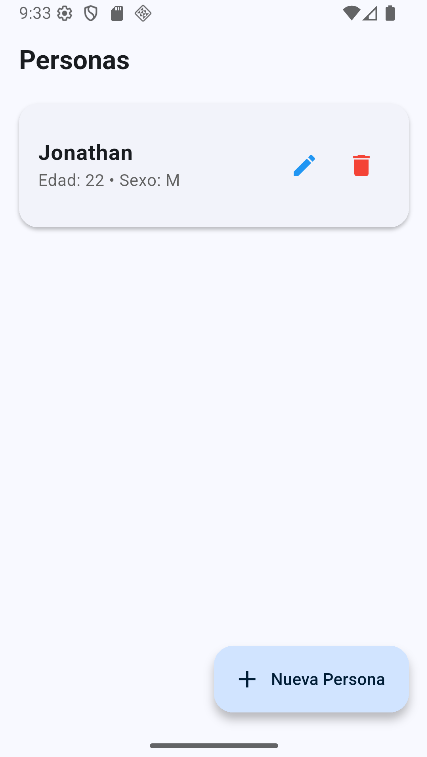
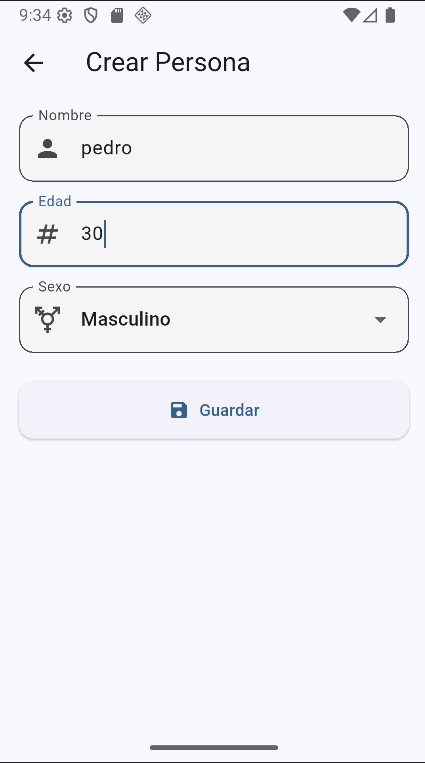
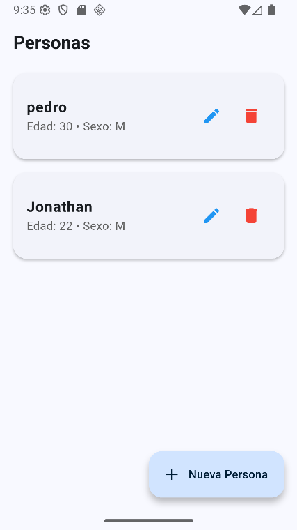
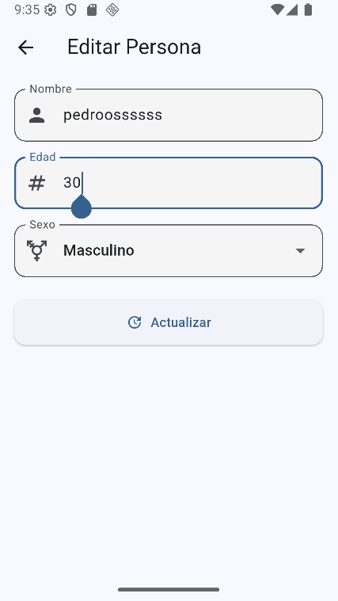
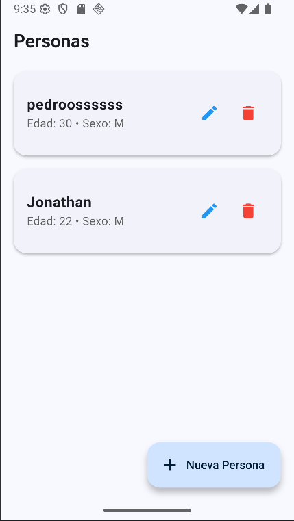
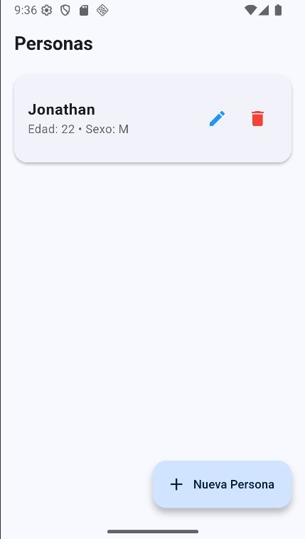

# CRUD Personas – Flutter + PHP + MySQL

Este proyecto es un sistema Full Stack compuesto por:

- **Backend:** PHP + MySQL (API REST con PDO)
- **Frontend:** Flutter usando el paquete HTTP para consumir la API.
- **Base de Datos:** MySQL (archivo .sql incluido)

Permite crear, listar, editar y eliminar personas desde Flutter comunicándose con PHP mediante HTTP.

---

# 1. Base de Datos

El archivo SQL para crear la base de datos está en:

back_end/crud_persona_api/crud_personas.sql

Debe importarse en MySQL antes de ejecutar el backend.

Tabla principal:

personas (
id INT AUTO_INCREMENT PRIMARY KEY,
nombre VARCHAR(100),
edad INT,
sexo VARCHAR(10)
)

---

# 2. Configuración de la Base de Datos

Archivo:

Modificar los siguientes datos según la PC de ejecución:

"<?php
private $username = "root";
private $password = "AQUI_TU_CONTRASEÑA";
"
-------------------------------

# 3. Rutas del Backend (API REST)

crud_persona_api/routes/personas.php

| Método | Ruta           | Descripción        |
| ------ | -------------- | ------------------ |
| GET    | /personas      | Listar personas    |
| GET    | /personas/{id} | Obtener persona    |
| POST   | /personas      | Crear persona      |
| PUT    | /personas/{id} | Actualizar persona |
| DELETE | /personas/{id} | Eliminar persona   |

Ejemplo de acceso:

http://localhost/crud_persona_api/personas

También funciona con IP de red local:
http://192.168.X.X/crud_persona_api/personas

------------

# 4. Controller y Modelo

PersonaController.php

Contiene las funciones:

listar()
obtener()
crear()
actualizar()
eliminar()

Cada función procesa las peticiones HTTP y devuelve JSON.

Persona.php (modelo)

Contiene todas las consultas SQL necesarias para:

Insertar
Actualizar
Eliminar
Buscar por ID
Listar

-----------

# 5. Flutter – Configuración de la API

El archivo que conecta Flutter con PHP es:

personas_flutter_app/lib/services/api_service.dart

Modificar la IP según dónde esté el backend:

Ejemplo si está en otra PC:

static const String baseUrl = "http://192.168.1.2/crud_persona_api/public";

puede hallar su ip con el comando ipconfig en el cmd

***Si no se cambia la IP, la app NO podrá conectarse al backend.***

eso seria todo para que la app pueda funcionar correctamente

## 📱 Pruebas de la App Funcionando

